# CrawlSpace

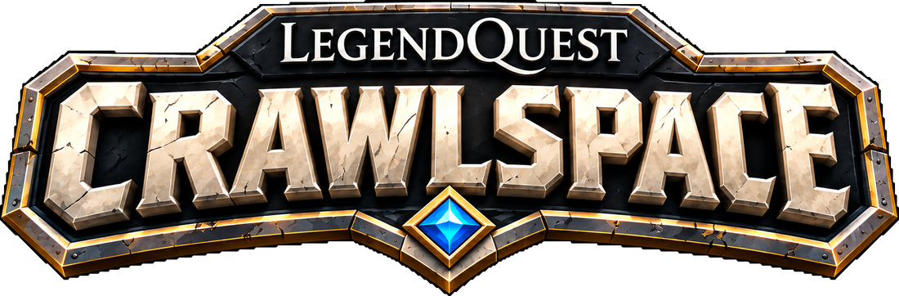

**Procedural roguelike dungeons for NeoForge — for everyone who misses
Roguelike Dungeons and Dungeon Crawl.**

A building stands on the surface: a castle keep, a round tower, a stepped
pyramid or a temple, dressed for its biome. Inside, a spiral stair leads down
to levels of rooms and corridors planned fresh for every dungeon. Each level
is themed, and harder the deeper you crawl: crypts, sunken halls, old mines,
caverns, deep halls.

- **Levels that do not feel like a grid.** Every level loops, with rooms in
  the middle of the loop and paths across it. Corridors run straight, at
  angles, in curves and as winding tunnels, with T and cross junctions where
  they meet, and they ramp between rooms at different heights.
- **Rooms that look lived in.** Crypts have sarcophagi, mines have timber
  frames, shrines have altars, guard rooms have mess tables, and halls have
  pillars and arches. Rooms also get panelling, coving, statue niches,
  overgrowth and clutter.
- **Danger that scales with depth.** Rooms wake their monsters as you
  approach, spawners turn up from the first level, and each lair has a named
  boss with a boss bar.
- **Traps and secrets.** Pressure plates and tripwires fire darts or poison
  gas, and some of them are decoys: faint red sparks mark the real ones.
  Break one or sneak-use it to try to disarm it, and it might go off in your
  face. Secret walls open onto treasure, and levers open locked iron doors.
  Pits drop you to the level below.
- **Loot worth the trip.** Five tiers by depth, with Mending, rare books,
  armour trim templates and trimmed, enchanted armour.

**Server-side only.** Vanilla clients can join and play everything.
Configurable spacing, depth and hints are in `config/crawlspace-server.toml`.
In a CityWorld world, cities keep clear of the entrance.

**Datapacks** can reskin any theme, change its monsters and boss, and add
entrance styles for chosen biomes. `/crawlspace export` writes the built-in
ones as a datapack to start from, and `examples/datapack` shows the shape.

Works on its own. With **LegendQuest**, traps stay hidden until your
character's Wisdom spots them, and disarming is a Dexterity roll (dwarves are
good at it). Other RPG mods can plug their own checks into `CrawlSpaceApi`.

Minecraft 1.21.11, 26.1.2, 26.2 and 26.3 (NeoForge). MIT licensed.

## Gallery

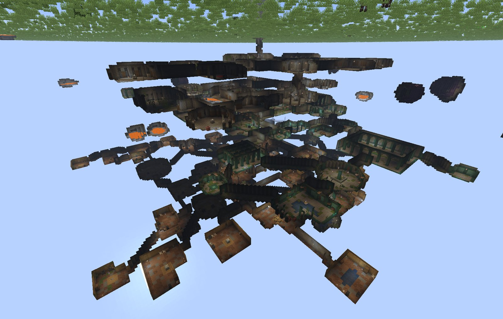

| | |
|---|---|
| 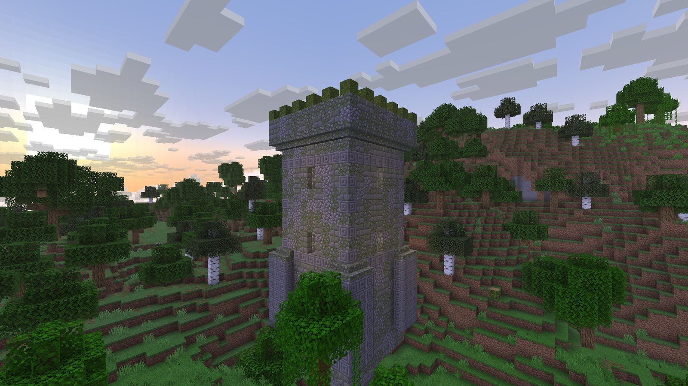 | 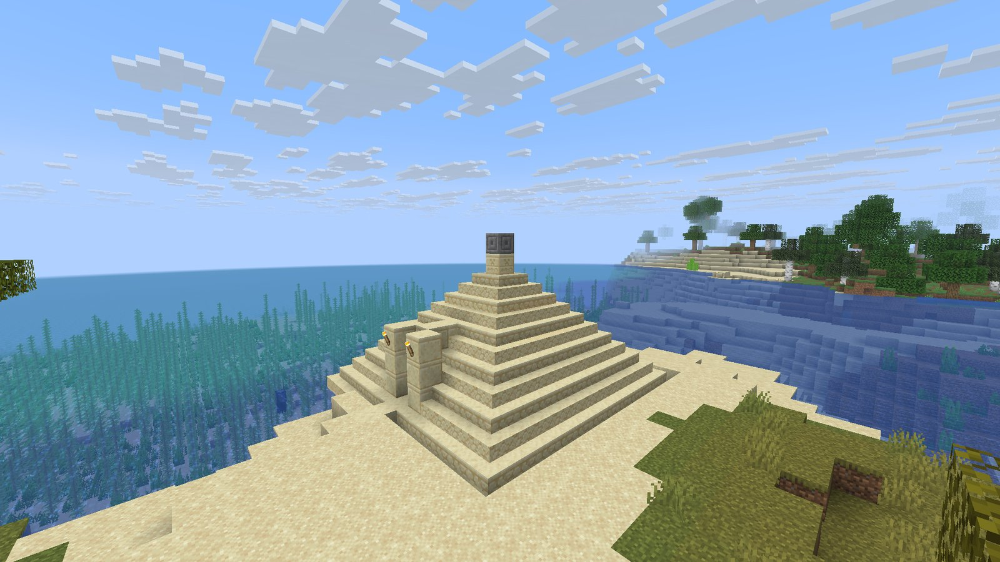 |
| 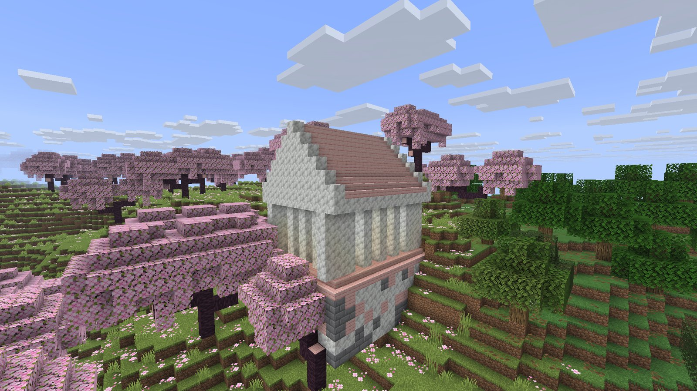 | 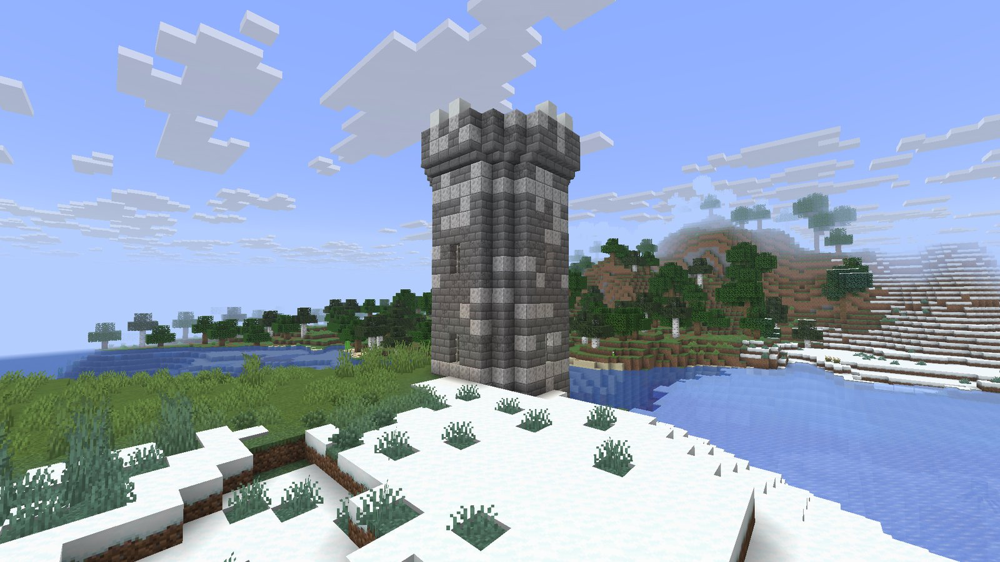 |
| 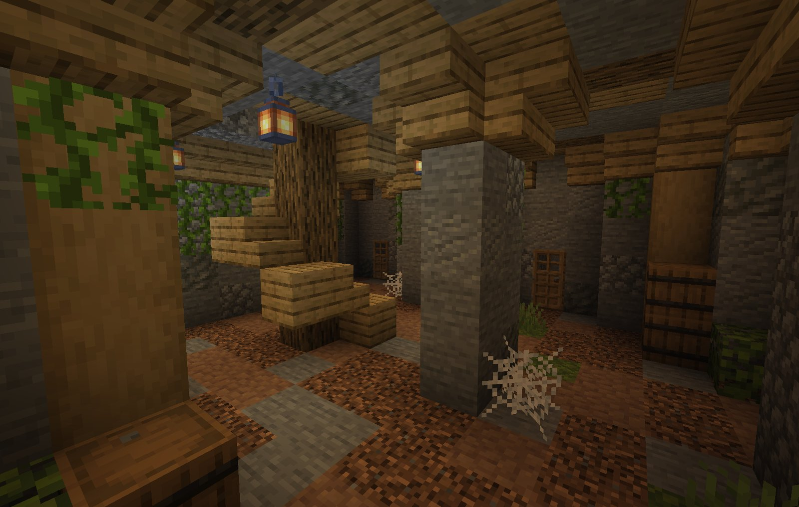 | 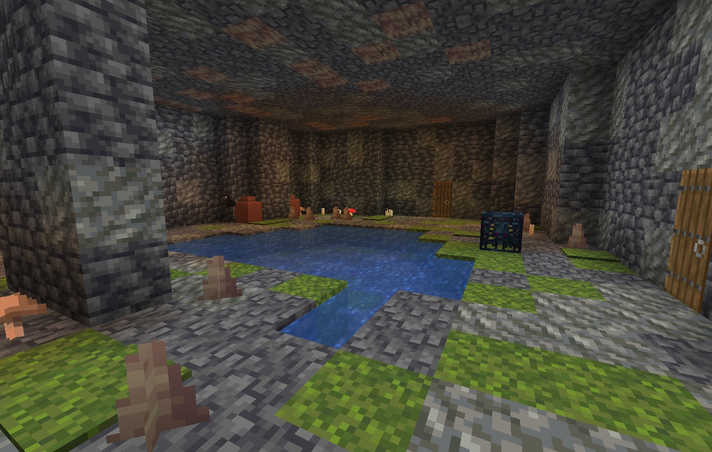 |
| 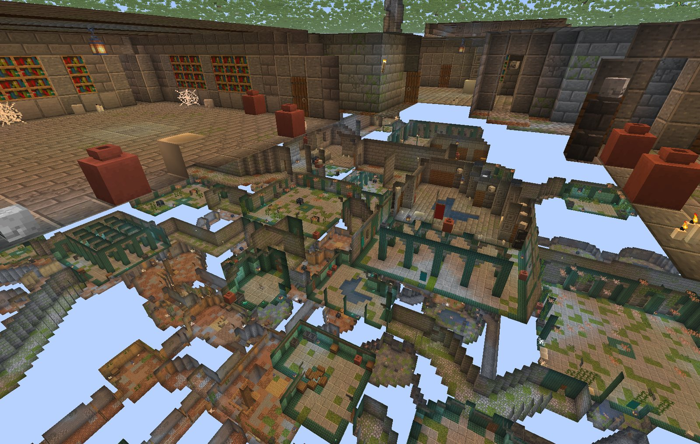 | 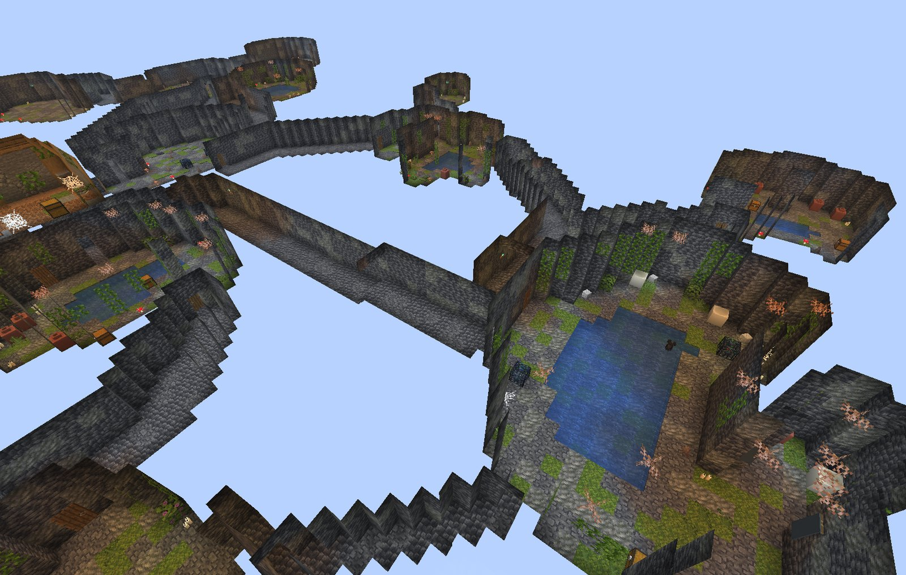 |

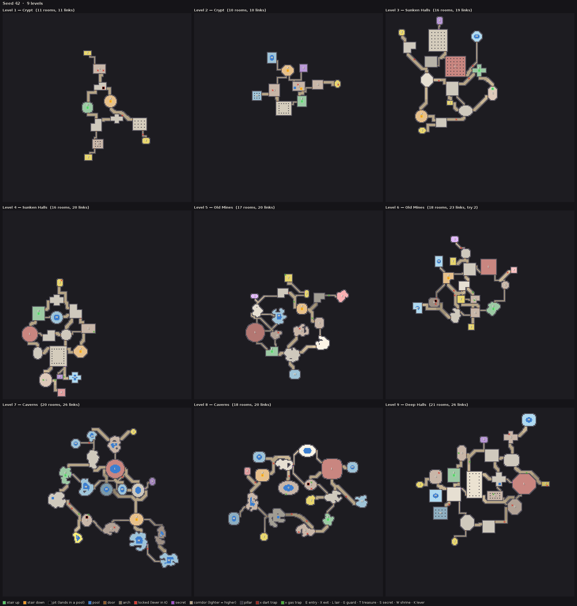
